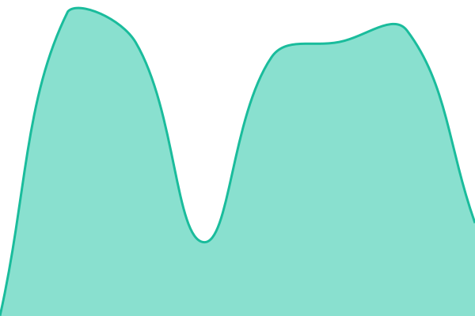

# [📈 Live Status](https://juan294.github.io/coach-upptime): <!--live status--> **🟩 All systems operational**

This repository contains the open-source uptime monitor and status page for [Juan González](https://chapa.thecreativetoken.com/), powered by [Upptime](https://github.com/upptime/upptime).

With [Upptime](https://upptime.js.org), you can get your own unlimited and free uptime monitor and status page, powered entirely by a GitHub repository. We use [Issues](https://github.com/juan294/coach-upptime/issues) as incident reports, [Actions](https://github.com/juan294/coach-upptime/actions) as uptime monitors, and [Pages](https://juan294.github.io/coach-upptime) for the status page.

<!--start: status pages-->
<!-- This summary is generated by Upptime (https://github.com/upptime/upptime) -->
<!-- Do not edit this manually, your changes will be overwritten -->
<!-- prettier-ignore -->
| URL | Status | History | Response Time | Uptime |
| --- | ------ | ------- | ------------- | ------ |
|  [Coach (App)](https://coach.thecreativetoken.com) | 🟩 Up | [coach-app.yml](https://github.com/juan294/coach-upptime/commits/HEAD/history/coach-app.yml) | 

 1068ms
     
 | 

<a href="https://juan294.github.io/coach-upptime/history/coach-app">100.00%</a>
    

|  [Coach API Health](https://coach.thecreativetoken.com/api/health) | 🟩 Up | [coach-api-health.yml](https://github.com/juan294/coach-upptime/commits/HEAD/history/coach-api-health.yml) | 

 756ms
     
 | 

<a href="https://juan294.github.io/coach-upptime/history/coach-api-health">100.00%</a>
    

<!--end: status pages-->

[**Visit our status website →**](https://juan294.github.io/coach-upptime)

## 📄 License

- Powered by: [Upptime](https://github.com/upptime/upptime)
- Code: [MIT](./LICENSE) © [Anand Chowdhary](https://anandchowdhary.com)
- Data in the `./history` directory: [Open Database License](https://opendatacommons.org/licenses/odbl/1-0/)
